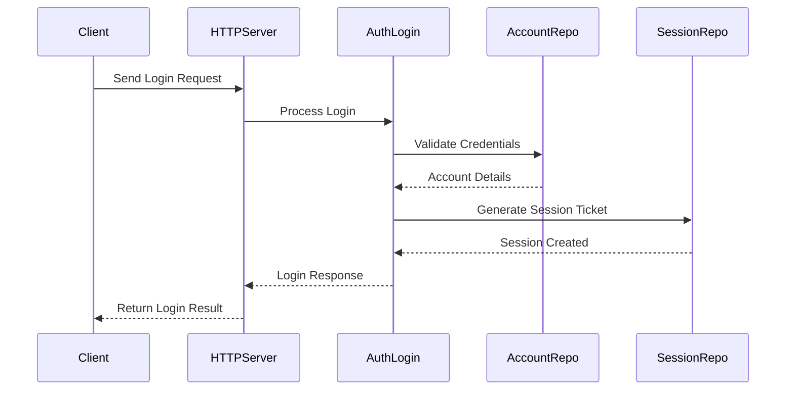

# Lotus

## Sequence Diagram

```mermaid
sequenceDiagram
    participant Client
    participant HTTPServer
    participant AuthLogin
    participant AccountRepo
    participant SessionRepo

    Client->>HTTPServer: Send Login Request
    HTTPServer->>AuthLogin: Process Login
    AuthLogin->>AccountRepo: Validate Credentials
    AccountRepo-->>AuthLogin: Account Details
    AuthLogin->>SessionRepo: Generate Session Ticket
    SessionRepo-->>AuthLogin: Session Created
    AuthLogin-->>HTTPServer: Login Response
    HTTPServer-->>Client: Return Login Result
```
